# 前言

中台的定义和理解即使在阿里内部也没有完整的表述，至少笔者没看到。中台即使在阿里内部依然是一个 [teenage sex][1]。本文的内容基于公开的文献、自身工作经历和内网论坛的历史帖子归纳总结。阿里虽然提出了中台思想，但内部没有专门的综述的文档。

本文涉及的中台专指阿里的业务中台，数据中台、技术中台不在本文的讨论范围内。

本文之所以会先谈淘系中台再谈蚂蚁中台，是因为淘系中台是演化出来的，蚂蚁中台是规划出来的。**好的架构是演化出来的**。

# 中台的定义

## 关于架构的几个基础思考范式

讲中台以前，我们需要先讲架构-关于架构师的基本问题，以后还会专文论述，此处先介绍一些简要版本：

- 定理 1 什么是架构：Martin Fowler 认为，架构应该是“**最高层次的系统分解**”和“**系统中不易改变的决定**” -《企业应用架构模式》。
- 定理 2 架构的价值是什么：Robert Martin 认为，软件架构的终极目标是，用**最小**的人力成本满足构建和维护系统的需求 - 《整洁架构》。
- 定理 3 架构的方向：通常在一个组织的大型系统里面，调用的控制流和信息流是自上而下的，下方的系统作为被聚焦的系统，更容易产生技术资产的积淀。

这几个范式，但凡做过架构设计的人都能隐隐约约地理解，是一些正确的废话。但如果真正自身境界提升，能够站在更高的视角来看问题，才能从**1 感知范式 到 2 理解范式 到 3 从范式出发**。

回顾下洋葱架构的圈层：

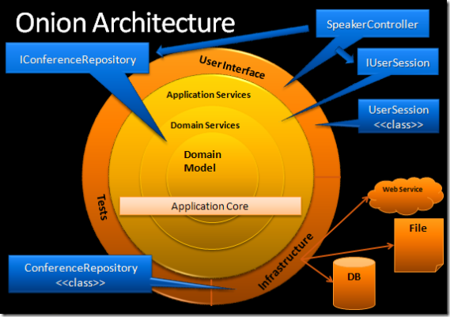

### 开宗明义-架构演化分期

一个容易被观察到的事实是，任何一个复杂业务都可以从一个简单的单体应用开始，逐渐演化。一般遵循 SOA 的原则，演化阶段分期是：


其实服务化的另外一个路径是指向微服务化的，这也是另外一个发展路径。

### 从模块化到服务化

以淘宝早年的电商系统为例。电商领域的基础问题很杂乱，复杂度各不相同：


在业务体量不是太大的时候，依葫芦画瓢，就会产生一些庞然大物的单体应用：


这种单体应用通常容易演变成[大泥球][2]，随意建这种系统的架构被称作**烟囱架构**，里面包含了很多庞然大物模块。模块间互相耦合严重，不易于修改，其缺点众所周知：

- 领域逻辑没有和其他关注点分离，专业的人没法做专业的事情，工作内容相互冲突，新业务扩展难度大-业务复杂度增高。
- 各个模块的升级、稳定性保障和性能调优都互相掣肘，很多问题没有办法在单一模块里解决-技术复杂度增高。

这个时候一般的架构师就想到要拆分系统，即模块要膨胀成系统，淘系电商当时通过千岛湖、五彩石等项目拆出来的结果大致上是：


服务化是一个巨大的突破，这也就意味着着业务模块的实体，**遵循 SOA 的原则被标准化为服务**，有了标准的服务形态以后，就可以进行**服务治理**，引入：

- 标准化的服务注册形态，诞生了标准的脚手架框架：webx 框架，服务有了注册、发现和池化调度的能力。
- 连接性问题和观察性问题的分离，诞生了：Dubbo、HSF、TDDL、Notify等分布式中间件（洋葱架构的圈层分隔在这里生效了）。

实际上，2014 年MSA（微服务架构）被提出后，淘系的高级架构师们思考外部的架构演进的过程中，还是看不出 MSA 和传统的 SOA 有什么区别，因为 MSA 只是 SOA 加上八条原则的一种实践版本罢了。但0809 年的拆分给淘系电商系统留下了巨大的技术遗产，一直受益到今天。

### 从服务化到平台化

但同样身为标准服务，服务之间也会有高度、厚度、深度的区别。

- 何谓高度：见[如何写复杂业务系统][3]。
- 何谓厚度：一个系统到底能够覆盖多广多复杂的业务场景，能够为更上游的系统提供多大的支撑能力？**一个有厚度的系统应该像一张桌子，能够放很多很多的书**。
- 何谓深度：一个系统能够把业务流程的复杂性、使用难度封装隐藏得多么好？把复杂的东西留给自己，让别人使用得简单而看不出流程的难度。**一个有深度的系统应该像一座冰山，十分之一的复杂度浮出水面被外面的人看到，让被人只和这十分之一的复杂度打交道**。

这三个尺度是架构师寻找架构结果的三个比较重要的审美指标，通过这三个指标可以把一些服务显著地同一些其他服务区分开来。

有一部分的服务，就会进化成平台，在上面那个图中，真正能够被称为平台的系统只是少数。


**实际上我们现在取名字动不动就叫什么 center、动不动就叫 platform 是不对的，严谨的架构学说应该寻找一些口径把平台系统专门挑出来治理。**

系统架构中出现平台系统以后，领导者就会专门组件平台类型的部门，沉淀专门的领域能力；而上层业务系统由专门的业务部门维护，进行快速试错（**洋葱架构的圈层分隔在这里又生效了**）。

在这里可以观察到的很重要的现实规律是，**系统的架构沿革会与组织架构的变动相依相伴，这甚至是影响架构变更的最重要的外部因素。详情请参阅[康威定律][4]**。

### 从平台化到共享服务化

淘系电商快速发展的过程中，在组织内部孵化了阿里巴巴、天猫、聚划算、淘宝旅行、淘宝彩票等业务。各个新业务线的玩法和淘宝的传统玩法有很大不同，各个业务线又要快速实现业务需求，各个新业务线的工程师要如何将自己业务特殊的逻辑落地？

- 选项1 - 把所有的业务逻辑都在淘系业务线的架构体系实现：

这当然是不现实的。

选项 2 - 各个业务线各个团队，自己建一整套相似的相关的体系。


为了满足快速上线的需求，重复建设成了一个很正常的选项，但也留下了很深的技术债务的，为接下来的共享服务架构理念诞生，共享事业部的出现埋下了伏笔。

重复建设的问题是：

- **从整个组织的层面上看，资源产生了极大的浪费，同样一条技术发展路径，需要用不同的团队来从零到一重新走一遍**。
- **每个团队的水平参差不齐，成熟度不统一，发展的历史阶段不同，踩坑的教训和成功的经验并没有很好地汇总到一起，一个业务线无法利用另一个业务线创造的平台能力，进而实现规模优势**。
- **如果出现了跨部门的协同工作，架构上的重复建设极大地增加了创新的沟通成本。快速落地灵活性带来的后续复杂度被低估**。

重复建设已经够可怕的了，更可怕的是不断重复建设。

解决重复建设的问题，只能回到资源整合，软件复用的基本思路上来。阿里决定推行共享服务层理念，建立了专门的组织架构-共享业务事业部：

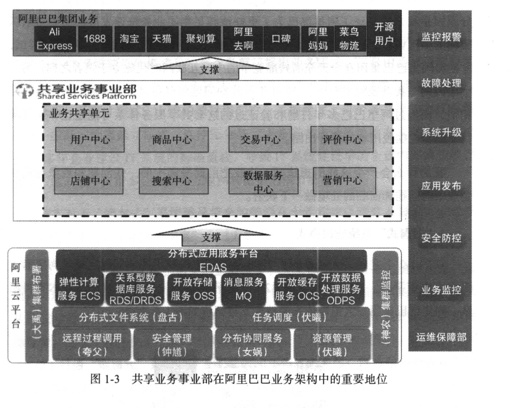

这个时候阿里巴巴在建设系统的时候已经喊出了“**厚平台，轻应用**”的口号，不断地剥离各个业务线的通用业务能力，下沉到共享业务事业部中。

这个过程中，共享业务事业部遇到的挑战非常大，因为这是跨组织的架构变动，实际难度非常大：

- **组织抗拒改变：根据康威定律，每一个组织都具有天然抗拒这种剥夺职责的优化的天性**，因为职责被优化掉以为了重要性被降低。每个业务线内部都有进行重复建设的优化的人，架构如果进行优化，等于这些人的工作被优化掉。

- **中台并不易用、好用**：每个业务线内部自建业务能力的时候，沟通顺畅如臂使指，如果把所有的业务能力沉淀，剥离到更远的组织边界之外，**实际的工作效率反而短期会下降**。

- **架构难度更大**：把多个业务线的业务能力重新抽象，并不是找一个地方重新堆叠就完事的，要重新进行聚合抽象。这是很多架构师很难遇到的场景，**除了大规模地拆系统，还要大规模地合系统，要进行架构设计难度反而变大**。

所以共享事业部一开始诞生的时候并不顺利，并不能立刻像灵丹妙药一样把重复建设的弊病消除掉，反而还带来了一些新的问题：

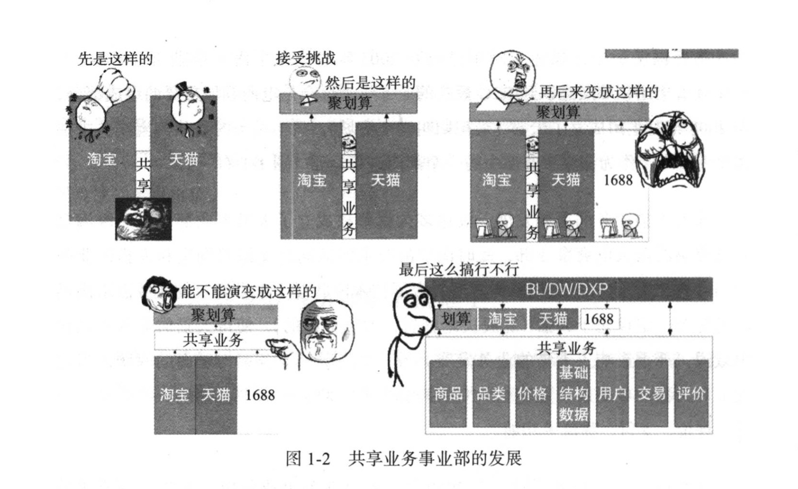

具体表现在，共享服务事业部大部分能力本身是从淘宝拆出来的，甚至团队也是从淘宝拆出来的，对于非淘宝的 bu 的需求的支持并不那么到位，强行使用共享服务事业部的服务能力反而让效率下降。而且因为某些原因，共享事业部自己也和淘宝、天猫的合作也并不愉快，因为淘宝和天猫对业务的直接共享更大，并不在意共享事业部对上层部门的赋能效应。

这个时候，阿里集团还没有明确地确认这种架构变革思路的重要性。

### 从共享服务化到中台化

到了 2015 年的时候，马老师带领阿里高管参观一个著名的游戏公司Supercell，Supercell从表象看有200多名员工，一个游戏通常4-5个人研发。大致可以分析Supercell采用的策略：

- 必须容忍很多失败：比如一个新项目在测试之前，团队就要设定一个指标，比如玩家留存、参与度，我们把这个目标告诉全公司的人，游戏进入测试之后，如果达不到指标，它就会被取消。
- 快速尝试：曾经在两年内，他们只发布了一款游戏《皇室战争》，但期间取消了9个项目，和若干很多优秀的创意原型。
- 招聘足够优秀的人：采用倒三角的模式组织团队，一个游戏公司等于若干创业小团队，小团队可以决定做什么，但没达成目标就必须中止。这决定了团队的每一个人是足够super的cell。

Supercell由于其游戏业务的特点，或与其它业务的研发模式不同。但有一个共同性思考，就是一个良好的中台首要的支持前台业务的快速创新。几个人干1-2个月，业务可以close，不用心疼。但如果百人月的产品，试错成本太高，时间方向也不满足高速变化的市场需要。

在这之后，阿里领导层提出了中台思想，简言之就是“**小前台、大中台**”- 等于“**厚平台，轻应用**”的口号被提升到了更高的战略高度，共享服务层的重要性得到了正名，全集团开始中台化，原有的共享业务事业部系统逐步转化为各个电商中台。

中台化以后的过程视图：

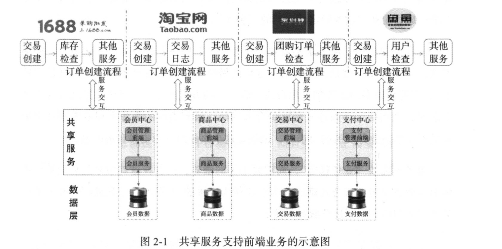

在这个战略高度下，技术资产的大小被分离了，阿里进入了兵团化大规模协同作战的时代：

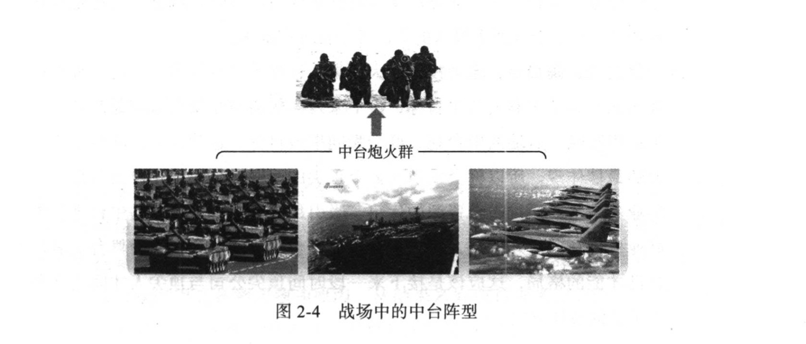

类比美军作战模式，就可进一步感受中台的作用。美军在二战时期，以军为单位作战；越战时变成以营为单位作战；中东战争时期进化为7人或11人的极小班排作战。之所以美军的“小前端”如此灵活，因为有强大的中台能力，给前端军队提供各种资源支持以及中台炮火群支持打击。

### 归根结底-何为中台

中台的特点：

1. **中：中台要位于中央，既不直接做业务，又把业务最通用的问题解决掉了**。中台重点解决业务发展过程中**从零到一**突破的问题，实现业务破局，最大限度地自底向上提供技术资产复用价值。前台系统在大部分的核心流程被收敛走以后，重点解决自己领域内的问题。例外：如果前台系统本身不存在复杂领域，前台系统甚至可以被省略点，完整的业务流程直接由业务中台**端到端交付解决**，实现了价值流水线的缩短。
2. **台：中台要有不同于一般平台的深度和厚度，能够打包输出平台能力**。按照玄难等人的观点，中台要把打包好的复杂平台能力以一个解决方案呈现给给业务方，如果没有更好地解决上游系统的问题，中台只是空中楼阁，甚至只是把平台换了个名字而已。
3. 微服务思想和中台思想无法兼容，中台需要向上层提供的是“平台产品”（蚂蚁的叫法）/“商业能力”（淘系的叫法），是对复杂流程的门面封装，微服务的实践会急剧增大架构中的编排复杂度。

## 热问题的冷思考

中台很热，可是中台就代表了正确的发展方向么？

### 中台也并不是没有缺点

综上所述，大家可能已经发现了：

1. 同样一件事，放在业务系统（前台系统）做需要 2 个人力，放在中台系统里至少需要三个人力-《人月神话》里更多。这种局部的效率变低是否是组织可以容忍的。
2. 上游系统永远觉得下游系统难用，下游系统离得越远越难用，跨越组织边界最难用。如果上游系统弱势，中台系统反而会阻碍上游系统开展业务。

### 中台的限定条件

每个组织在看待自己的技术架构，进行技术规划的时候，一定要尊重客观规律，哪怕要进行弯道超车，也要想清楚自己的定位。

王慧文有一句话，全中国只有阿里的组织力是溢出的。在市面上大多数公司的规模都很小，只有极少数的公司是独角兽公司，有极少数公司是大象公司，只有阿里和腾讯是恐龙级公司。而只有阿里才有资本和行动力在许多的战场上利用技术团队发动大规模攻势攻势。

中台对于阿里而言是平台化演进自然而然的结果，对其他公司并不是自然而然的结果，可能是邯郸学步的结果。中台是阿里针对组织变大以后复杂场景提出的解法，是对设计做设计，对研发体系做设计，并不一定就正确。建中台的成本是刚性的，一件事如果交给前台系统自己解决，局部的成本一定低于放在中台层，所以建设中台要在全局算账能够得到最优解，回归架构设计的本源价值-最大化地节约成本。大家最好还是客观地看待追求共性和容纳个性的平衡，事情并不一定都那么美好。阿里内部也在探索中不断反思中台是否真的如预想中的那样能够产生价值，中台思想是一个还在不断证明自己的理论。进行中台建设的时候，要回答几个问题：

1. 中台要支撑的业务场景要非常复杂多变，需要有多变的创新业务场景，展开快速的试错。**组织是不是有这样的现实场景和行动力来通过试错来最大化中台价值**？
2. 中台是资源/资产整合的结果，中台很难凭空出现。**中台是否真的有足够的深度和厚度，不只是平台换个名称**？
3. 中台的出现很容易就产生剥离效应，中台是前所未有的**大衙门**，要真正支撑中台的诞生，**组织是否有有战略级的推动力，推动组织变革，破解康威定律**？


阿里设想的中台是这个样子的：

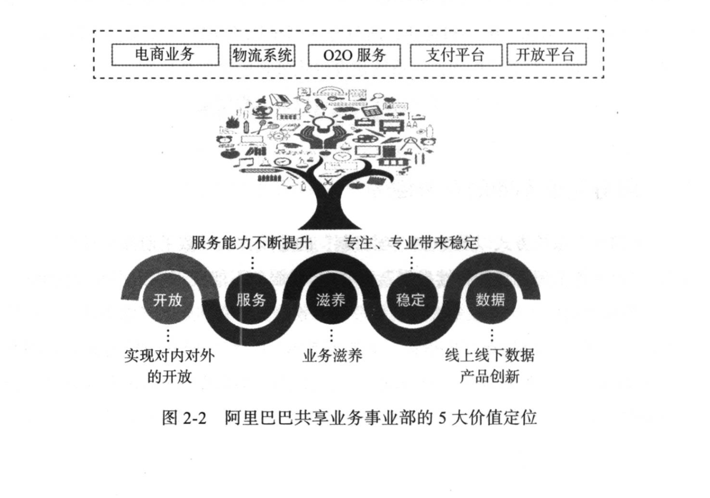

如果学中台学得邯郸学步很容易做成这个样子：

**奥卡姆剃刀定律：如无必要，勿增实体。套用俞军的产品公式：迁移意愿 = 新解决方案的收益 - 迁移成本**

### 另一种答案-不要跨过复杂度阈值，继续做平台化也很好

1. 短期来看，建设可复用的系统架构的成本很高，“快速上线”是一个非常有诱惑力的毒苹果，要避免诱惑。
2. 长期来看，进行全域架构设计，**实现架构统一来构建系统的重要性被严重低估了**。
3. 搞架构演进最好不要大跃进，不要要么“先快速上线搞一波”，然后“学习 xxx，全体 xxx 化”，中庸之道，小步每天前进三十公里也许更好：**资源整合应该一有空隙就进行**，技术债应该一有空就还，即使是在域内做小平台，也是很有价值的事情，好的架构可以产生很多年的收益。

## 蚂蚁保险的中台

### 保险业务的本质

保险并不只是买一个金融产品，然后出事了就赔。

互联网售卖的保险的本质是一份法律合约作为商品出售，商品本身还具有金融属性
- 从电商视角来看，保单是商品，需要有其他售后流程，要有完善的电商正逆向系统设计。
- 从金融核心系统来看，保单是金融凭证，要遵循账证实平衡模型和相关流程。

### 全功能的保险系统要面对的业务场景

- 搭售场景的保险，通常为短期保险：
 - 正向流程：售卖
 - 逆向流程：理赔、退保、批改
- 更广义的保险，实际上分为财产险（又可分为车险和非车险）、人身保险（意外险、旅行险、健康险、寿险、万能险等若干类目（认识类目是很不一样的））：
 - 意外险：短期保险为主，售卖方式简单，售后流程最简单，主要是理赔、退保和简单的批改。
 - 旅行险：业务场景与意外险很相似。
 - **健康险**：周期可以是长期也可以是短期。正向流程里，售卖方式涉及趸交、期缴，逆向流程较为复杂，涉及退保、批改，售卖场景的交易因子会影响退保和批改，售卖、退保和批改会影响续期、续保，退保、批改、续期、续保会影响理赔。
 - **寿险**：寿险都是长周期保险，本身还具有投资品属性，可以像余额宝一样进行批改定投，又具有分红功能（分红还可以提现和复投），还可以进行保单质押和贷款。
 - **车险**：保险标的有很多特殊的强领域属性是其他类目没有的，甚至在财产险里也是独一无二的，他的理赔查勘流程也和其他类目的保险不一样。因为车险的流程特别复杂，所以即使是专业的保险公司也需要专门的核心系统来承接相关业务。
 - **财产险**：保险标的千变万化，理赔的流程和批改的杂项也因此特别多。
 - **万能险**：待补充

实际上保险作为一种金融凭证，可以涉及的交易场景非常多，绝不只是买了退或者赔那么简单。一个交易场景的交易因子会影响其他交易场景的交易因子。

### 避免升维打击，规划出来的架构

一个木桶如果有短板，装一半水的时候还能运作，装满水的时候就会漏水。

一套业务系统如果覆盖的业务场景不够全面，在业务扩展到需要更多维度的战场的时候，就会因为缺失维度而遭遇失败。

阿里经济体里有很多分代架构的概念，每次做大的架构演进的时候，都要想办法预测本部门若干年内的机遇和挑战，尽量向前架构，争取一套架构解决若干年问题（见上方聚石塔、千岛湖项目，一做完能管很多年）。

如果要用规划的方式来做架构，要尽量有前瞻性地预测业务场景，尽量避免缺失维度，遭受升维打击。

**蚂蚁保险很早就准备在未来转型成一家真正的保险公司**，所以一开始就思考如何对标全行业的全场景，进行完备的系统建设。

### 用中台来解放业务线

复习一下，中台思想适用的场景：

- 有复杂多变的业务线，需要快速地铺开队伍。
- 核心流程从零到一突破的时候，需要厚度和深度进行重点支撑。


### core 与 prod，核心中台与业务中台的领域拆分

按照传统的贫血模型+transaction script 的写法：

- service 可以被分为一层。
- entity + crud 可以被分为一层。

蚂蚁架构会把 service 模块演化出来的系统称作 prod 系统，把 entity + crud 模块演化出来的系统称作 core 系统。

- **prod 作为中台被称为业务中台，管0-1 的业务流程**。
- **core 作为中台被称作核心中台，管核心的领域服务**。


### 以售卖流程为例

状态机：init -> underwrote -> paid -> valid

架构图略：insmobile -> inslifeprod -> instradeprod -> bxcore -> 金融网关

# 多余的话

1. 组合式创新 -> 颠覆式创新
2. 郭东白博士[对于中台的思考][5]。郭东白给中台提供了精彩的定义，前台系统给用户提供有业务属性的计算能力，**中台系统给前台系统提供了较通用的、有业务属性的计算能力，后台系统给中台系统提供不带业务属性的计算能力**。
3. 陶文的[《中台之“中”》][6]。
4. 架构是关乎组织分工的设计。跳出技术框架来看，bounded context 是有界的，有界的东西可以分解业务。

  [1]: https://zhuanlan.zhihu.com/p/20570238?columnSlug=hemingke
  [2]: https://www.jianshu.com/p/b4eb9bf79374
  [3]: https://magicliang.github.io/2022/01/07/%E5%A6%82%E4%BD%95%E5%86%99%E5%A4%8D%E6%9D%82%E4%B8%9A%E5%8A%A1%E7%B3%BB%E7%BB%9F/
  [4]: https://www.infoq.cn/article/every-architect-should-study-conway-law
  [5]: https://magicliang.github.io/2022/01/10/%E9%83%AD%E4%B8%9C%E7%99%BD%E5%8D%9A%E5%A3%AB%E3%80%8A%E5%85%B3%E4%BA%8E%E4%B8%AD%E5%8F%B0%E7%9A%84%E6%80%9D%E8%80%83%E5%92%8C%E5%B0%9D%E8%AF%95%E3%80%8B/
  [6]: https://zhuanlan.zhihu.com/p/82586450