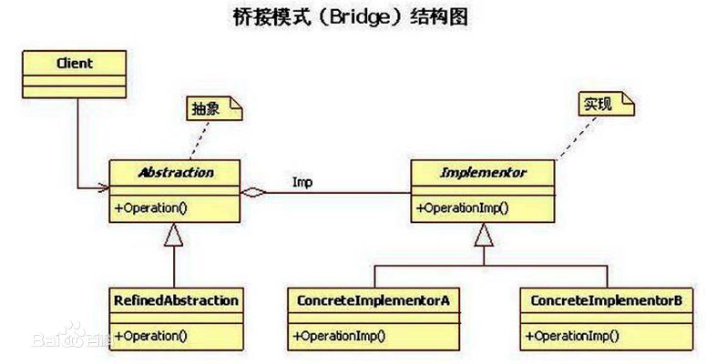
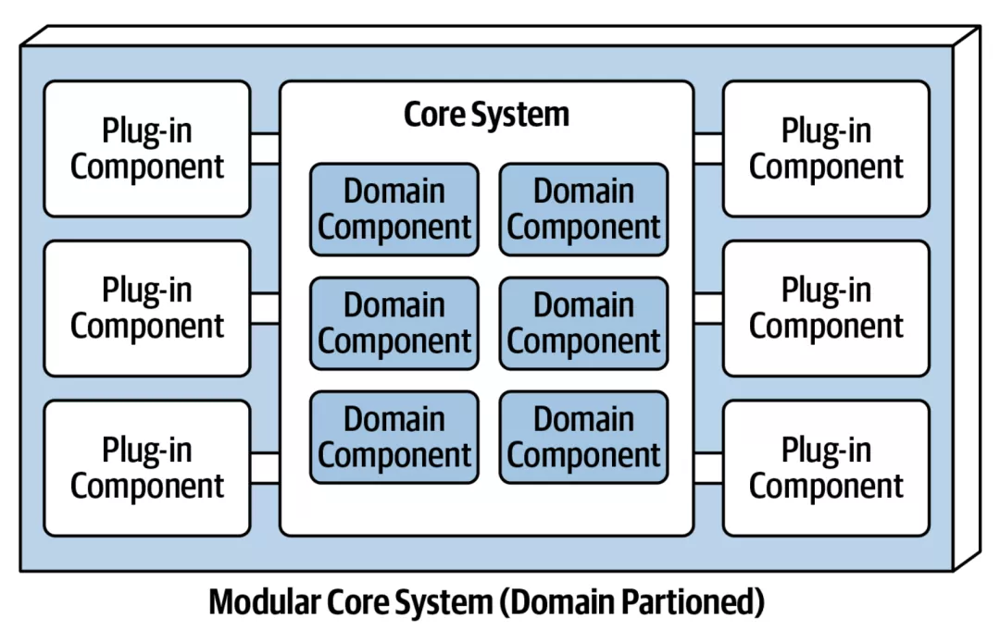

1. 本文是如何写[《复杂业务系统》][1]和[《我眼中的阿里经济体的中台架构演进》][2]的续篇。
2. 本文探讨到底不确定性和复杂性源于何处，并引出互联网业务系统的一种“可适应性架构”，适用于平台型业务系统。

# 定义问题

软件难写，是软件工程师的共同感觉。

特别地，对于中国的互联网公司的“业务团队”的工程师而言，“业务系统”在业务的复杂度堆积到一定程度以后，软件本身的“熵增效应”会特别严重：一个业务系统的内部会充满了难以理解的分层、堆积如山的 if-else 分支，以至于很多工程师都不愿意进入密密麻麻复杂逻辑深处，去做高风险的维护工作。但是，只要公司正常发展，业务总会越做越大/复杂，所以要维持系统的可维护性，成为了一门很重要的学问。

现实中的系统的高复杂度问题，可以简单表述为“**不确定性矛盾**”：需求具有高度不确定性，一直都在高速变化；而工程师高度倾向于确定实现（因为高度抽象、反复抽象的成本很高），所以具体的实现难以变更，这两种相反的特性难以调和。

其实我们现在遇到的困境，历史上发生过很多次，比如我们现代的很多软件工程理论，就是从历次的[软件危机][3]中诞生的。归根结底，**软件之所以叫软件（Software），是因为相对于硬件，它应该是易于变更的**。这些软件工程理论演化到现代，有两条基本的原则是放之四海皆准的：

- **计算机程序是写给人看的，恰好能够运行**。
- **软件设计其实就是对于抽象复杂度的控制**。

具体地，解决不确定性问题的解法其实是：**尽量用分门别类的方法来理清软件的确定部分，保留余地给不确定性，使用特定的表达手法来表达不确定性。可维护性问题只是工程量问题，以不变应万变是工程量最小的方案**。

## 正交分解法

系统性问题，需要系统性的解：系统性的问题如果可以下钻，就可以自顶向下地把问题拆解成子问题，如果子问题都有解，那么它们组合起来就会得到一个系统性的解。

### 笛卡尔的解

但应该用什么方法来下钻呢？笛卡尔坐标系可以给我们提供经典思路：

1. 把一个复杂的，让人大脑容量爆炸的问题先扔掉。
2. 先建立一套彼此可以正交组合出无数能力的基础工具系统。
3. 自顶向下地拆解问题。
4. 自底向上地组合问题的解。

### 捏脸系统


上图是一个网络游戏中常见的建立游戏角色的系统，玩家通常可以指定游戏角色的发型、衣着和眼睛样式。按照笛卡尔坐标系的思路：

1. 我们可以建立三个单一维度：发型、衣着和眼睛样式。
2. 通过穷举的方法，设计和限定每个单一维度的枚举值。
3. 设计一个组合方法，来表达这种组合。



如果建立这种正交体系，则用户的输入是对于不同的枚举值的选择，用户得到的输出是近似向量形式的。

这种向量形式的表达能力极强，仅以上图为例：

1. 用户实际可选的最终结果是这个解空间的笛卡尔积的数量为：2*3*3=18 种组合。
2. 每增加一个维度上的枚举值，都可以很简单地放大解空间：在和服之外加上一种“墨西哥服装”，则解空间实际上变为 24 种组合。
3. 每一种枚举值都非常稳定，因为他们彼此互斥，所以非常稳定，不会因为用户的输入而产生混乱的变化。
4. 组合的方法非常有规律，只要把向量的维度顺序排好，按部就班地输出枚举即可，组合逻辑本身并不混乱，也不受枚举值的影响。
5. 我们还可以再通过增加维度的方法，极大地扩充我们的解空间。如果我们在 2 的基础上再增加一个有 3 枚举值的维度“鼻子”，我们的解空间进一步升级为 72 种组合。

这种正交分解法正是面向不确定性编程的方法：

1. 应该尽量把整个解空间分解出多个维度。
2. 在维度上找到具体的解，这种具体的解必须是互斥的、可枚举的、甚至是可演绎的（这套分解方法，也是美团基本功的[《金字塔原理》里经常思考的不漏不重][4]），也必须是具体的、可实施的。这些解和维度，就是我们系统的“确定性部分”。
3. 找到一种组合方法，将这种向量组合出来，如果有可能将组合的策略交给用户。这种组合的具体值，就是我们系统的“不确定性”部分。

我们的系统必须先寻找到确定性部分，然后才能支撑不确定性部分的运行。


实际上，现实中的笛卡尔坐标系，只要有一套计算流程，可以表达任意复杂的曲线和图形。

### 百科全书式的架构师

那么如何寻找确定性部分？通常的思维方式是：


到底怎样的穷举、归纳、演绎是好的？引用[《软件方法》][5]里的观点：建模带来竞争优势。如果我们运用 DDD 的方法进行分析，我们对核心域的理解决定了我们是不是能够找到确定性的部分。**所以对于业务系统的架构师而言，对自己的系统的百科全书式的理解是重要的**。理解自己的系统到底有多少个环节，每个环节有多少变化，至关重要。

所以这一段的结论是：复杂系统可以用正交分解来解。

# 重新说说什么是系统的高度-为什么要旗帜鲜明地反对意大利面条式的代码

面向不确定性的系统，必然是可维护的系统，可维护的系统应当是有高度的（这个问题最初在 [《我眼中的阿里经济体的中台架构演进》][6]里有提到，但这里还是要再提一次）。

## 工程量问题

在这里要先抛出一个观点：**一切可维护性问题，都是工程量问题**。内部架构不当的系统，改造工程量特别大。工程量最小的改造方法，是只改造一个模块。

## 线性复杂度代码

难以理解的代码通常是这样的：

```java
List<Long> commodityIds = Lists.newArrayList();
            PageRpcDtp page = null;
            if (query.getIndexPageId() > 0) {
                Assert.isTrue(isRealIndexPageId, "错误信息");
                if (pageSize <= 0) {
                    pageSize = pageSizeMap.get(ModuleTypeEnum.RECOMMEND);
                }
                PageResponse infoResponse = commodityService.getModuleInfos(Convertor.buildInfoRequest(query.getIndexPageId(),
                        Lists.newArrayList(),
                        pageNo, pageSize, "display_sort asc"));
                if (infoResponse != null) {
                    page = infoResponse.getPage();
                    if (infoResponse.getData() != null &&
                            CollectionUtils.isNotEmpty(infoResponse.getData().getSomeModuleInfos())) {
                        for (SomeModuleInfoRpcDtp infoRpcDtp : infoResponse.getData().getSomeModuleInfos()) {
                            commodityIds.add(infoRpcDtp.getCommodityId());
                        }
                    }
                }
            } else if (query.getCategoryId() > 0) {
                PageResponse pageResponse = commodityService.getCategoriesByCondition(Convertor.buildCategoryRequest(mallSourceId, 0, 0, "display_index"));
                Set<Long> categoryIdSet = Sets.newHashSet();
                // 验证分类
                if (pageResponse != null && pageResponse.getData() != null &&
                        CollectionUtils.isNotEmpty(pageResponse.getData().getMallCategories())) {
                    for (SomeCategoryRpcDtp tDto : pageResponse.getData().getMallCategories()) {
                        categoryIdSet.add(tDto.getId());
                    }
                }
                if (query.getCategoryId() > 0) {
                    Assert.isTrue(categoryIdSet.contains(query.getCategoryId()), "该分类不属于该来源");
                    if (pageSize <= 0) {
                        pageSize = pageSizeMap.get(ModuleTypeEnum.CATEGORY);
                    }
                }
                PageResponse infoResponse = commodityService.getCategoryCommodity(Convertor
                        .buildCommodityCategoryRequest(query.getCategoryId(), pageNo, pageSize, "display_idx"));
                if (infoResponse != null) {
                    page = infoResponse.getPage();
                    if (infoResponse.getData() != null &&
                            CollectionUtils.isNotEmpty(infoResponse.getData().getSomeCategoryCommodities())) {
                        for (SomeCategoryCommodityRpcDtp infoRpcDtp : infoResponse.getData().getSomeCategoryCommodities()) {
                            commodityIds.add(infoRpcDtp.getCommodityId());
                        }
                    }
                }
            }
            Map<Long, SomeCommodityRpcDtp> commodityMap = Maps.newHashMap();
            if (CollectionUtils.isNotEmpty(commodityIds)) {
                List<SomeCommodityRpcDtp> commodityRpcDtps = commodityService.getCommoditiesByIds(commodityIds);
                for (SomeCommodityRpcDtp cDto : commodityRpcDtps) {
                    commodityMap.put(cDto.getId(), cDto);
                }
            }
            CommodityListResponseVO responseVO = new CommodityListResponseVO();
            responseVO.setPageSize(pageSize);
            responseVO.setIndexPageId(query.getIndexPageId());
            // 给前端返回结果1表示还有更多数据，0表示没有了
            responseVO.setHasData(page != null && page.getPageNum() < page.getPages() ? 1 : 0);
            responseVO.setCategoryId(query.getCategoryId());
            List<CommodityConfigInfo> commodityConfigInfoList = Lists.newArrayList();
            responseVO.setCommodityList(commodityConfigInfoList);
            if (MapUtils.isNotEmpty(commodityMap)) {
                for (Long commodityId : commodityIds) {
                    if (commodityMap.containsKey(commodityId)) {
                        commodityConfigInfoList.add(convertThrift2ConfigInfo(commodityMap.get(commodityId)));
                    }
                }
            }
            response.setData(responseVO);
```

有经验的工程师看到这样的代码，第一反应是，这一段代码的维护成本很高。但维护成本到底高在哪里？

这种[意大利面条式的代码][7]，难以维护的原因在于阅读的**时间复杂度太高**。缺乏结构设计的代码就好像一个扁平的线性表，人脑阅读的时候的处理过程和平扫线性表算法一样，时间复杂度是线性的（O(n)）。人脑天然反感线性复杂度的单调扫描，所以阅读这种代码心智负担（mind burden）很重，既容易出错，也难以维护。更大的阅读量，一定带来更大的改造量。

## 对数复杂度代码

我们经常说好维护的代码是什么样的呢？比如 Spring 自己的核心流程：

```java
@Override
    public void refresh() throws BeansException, IllegalStateException {
        synchronized (this.startupShutdownMonitor) {
            // Prepare this context for refreshing.
            prepareRefresh();

            // Tell the subclass to refresh the internal bean factory.
            ConfigurableListableBeanFactory beanFactory = obtainFreshBeanFactory();

            // Prepare the bean factory for use in this context.
            prepareBeanFactory(beanFactory);

            try {
                // Allows post-processing of the bean factory in context subclasses.
                postProcessBeanFactory(beanFactory);

                // Invoke factory processors registered as beans in the context.
                invokeBeanFactoryPostProcessors(beanFactory);

                // Register bean processors that intercept bean creation.
                registerBeanPostProcessors(beanFactory);

                // Initialize message source for this context.
                initMessageSource();

                // Initialize event multicaster for this context.
                initApplicationEventMulticaster();

                // Initialize other special beans in specific context subclasses.
                onRefresh();

                // Check for listener beans and register them.
                registerListeners();

                // Instantiate all remaining (non-lazy-init) singletons.
                finishBeanFactoryInitialization(beanFactory);

                // Last step: publish corresponding event.
                finishRefresh();
            }

            catch (BeansException ex) {
                if (logger.isWarnEnabled()) {
                    logger.warn("Exception encountered during context initialization - " +
                            "cancelling refresh attempt: " + ex);
                }

                // Destroy already created singletons to avoid dangling resources.
                destroyBeans();

                // Reset 'active' flag.
                cancelRefresh(ex);

                // Propagate exception to caller.
                throw ex;
            }

            finally {
                // Reset common introspection caches in Spring's core, since we
                // might not ever need metadata for singleton beans anymore...
                resetCommonCaches();
            }
        }
    }
```

这样的代码为什么可维护性好？因为这样的代码把解决问题的方案拼成了**树形结构**。对上层模块而言，每一行代码都是对下层的模块的点到为止的调用，而不是对同层方法的堆叠，如果存在下层模块，则具体的逻辑全部交给下层模块实施，本层只做策略编排。这种类似多路平衡树的阅读时间复杂度实际上是对数复杂度（O(logN)）（类似数据库的存储搜索方法），这种复杂度对于人脑而言是舒服的，人可以一步一步，精确地定位到特定的范围，逐步解决问题。我们经常提到的 Gof 23 种设计模式，也充满了这种分层解耦的设计思路，运用特别广泛的[桥接模式][8]、[工厂方法模式][9]和[模板方法模式][10]，都使用了这种管理复杂度的技巧。但设计模式又并不仅仅使系统有树形结构，节点和节点之间的连接还是通过扩展点连接的。所以我们在同层里增加具体的枚举值的时候，是用具体值对系统进行扩展，而不是修改（又见 [OCP 法则][11]）。



这就是为什么我们在[《如何写复杂业务系统》][12]里提到的，坏的代码很像流水账，而好的代码像博士论文。而且好的代码必须保持[抽象的层次一致性][13]。

现实中，意大利面条的代码为何总是会让维护者也写成意大利面条式的代码？因为几代维护者已经把线性复杂度的代码写得很长很长，除非遗留代码的维护者制造一个大的结构，把所有的代码分割进小模块里，否则单纯地局部模块化只能制造抽象的层次不一致（违反了上面提到的抽象的层次一致性）。这就是很多时候大家都不愿意重构，总是喜欢重写的原因。修改难以维护的老系统的时候，既要花线性复杂度的时间读完一个大组件的代码，也得仔细斟酌，写出适应这种线性复杂度的 patch（更大的阅读量带来了更大的改造工程量）。

在这里我们可以再谈谈 OCP 原则在实战中的意义：在不能进行有效的复杂度治理的工程里，所有的代码逻辑共用复杂度，原本复杂度为 9 的项目，在新增一个复杂度为 1 的解决方案的时候，可能新解决方案要处理的最终复杂度是 10 而不是 1；而引入了带有组件封装色彩的设计模式以后， 新增一个组件的复杂度就仅止于这个组件的复杂度边界本身。组件和组件之间的封装边界隔离了复杂度，组件支撑起了框架，也实现了复杂度的平行添加而不是线性添加。所以烂代码是把问题和解决方案混合在一起的，通篇都是流水账，好的代码是把问题区分开，把解法挂在问题这个钩子上，只有组件内部是记叙文，组件之间都是一个个模型、对象。

总结一下这个章节的核心观点是：面向不确定性的系统必然是易于维护的系统，易于维护的系统是必然是有高度的系统，有高度的系统的终极形态是：树形的，分层带有专门扩展点系统。工程量的大小，取决于扩展点的大小。

有一类树形系统的演化思路，大概是这样的：


# 扩展点的学问

[阿里的 cola 框架的设计哲学][14]是：

```java
public Long create(MyCspuSaveParam myCspuSaveParam){
        SaveCSPUContext context = initContextStep.initContext(myCspuSaveParam);

        checkRequiredParamStep.check(context);

        checkUnitStep.check(context);

        checkExpiringDateStep.check(context);

        checkBarCodeStep.check(context);

        checkBarCodeImgStep.check(context);

        checkBrandCategoryStep.check(context);

        checkProductDetailStep.check(context);

        checkSpecImgStep.check(context);

        createCSPUStep.create(context);

        createCSPULogStep.log(context);

        sendCSPUCreatedEventStep.sendEvent(context);

        return context.getCspu().getId();
    }
```

有读者可能会问，为什么阿里的代码要使用 context 作为方法参数，而不是使用具体的参数来调用方法？

## 从面向框架编程，到面向插件编程

这里要引入一个观点：**框架决定 API，业务框架决定业务 API，由业务 API 关联业务组件**。

现实的日常工作中，我们谈到框架/库的时候，很多时候我们意识不到一点：

- 我们在为框架写代码，真正调用我们的代码的代码，是框架本身。
- 我们在调用库的组件里的代码，真正调用库代码的代码，是我们的业务。
- 好的服务= 好的框架 + 好的组件

但我们和框架的交互非常地简单，很多时候我们甚至感觉不到框架的存在（这从某种意义上来讲是 Spring 之类的框架的成功之处）。

我们常见的微内核操作系统、Spring 框架之类的复杂系统，都要求客户端对根据它的 API 规范进行“组件编程”。



在这种架构模式下面，整体的“策略的编排”是由一个单独的层次实现的，所有的业务方遵循统一的 API 标准，实现业务流程的一部分。基于这种架构写出来的系统有几个优点：

- 业务策略的编排和策略的实现完全解耦，**策略的实现插件化（什么是插件化，业界并没有严格明确的定义，此处借用了这个流行的概念）**。插件化是一种未来的开发理念，插件化的终极状态是配置化（反过来也一样）。这是由帕累托法则决定的。
- 因为有隔离，组件稳定性极强，适合“原子化的组件设计模式”

实际上因为这种原子化的优势，这种设计模式在操作系统驱动领域大行其道；而这种原子化的能力，恰好也适合领域驱动设计里对领域能力“原子化正交化”的要求。插件化架构，很适合领域驱动设计。

假设我们有一个业务框架，处于我们的业务代码和技术框架之间，而我们把我们的业务代码组件化，作为更上层系统的库，我们大概会得到这样一个架构：



这个架构里面：

- 组件通过扩展点被上层调用。
- 有一个隐式的框架，管理 context，管理流程，编排插件。

这样就呼应了我们在第一个章节里讲到的“正交分解再组合”的设计思路。因为，指定了 context api 这种标准化扩展点，所以理论上：

- 每个领域可以无限扩充流程节点
- 每个领域内部可以无限扩充可枚举的领域策略

基于这两个优点，我们就可以得到一个具有演绎性的系统，如果我们有意识地给这种系统增加层次，我们就呼应了我们的第二个章节的观点，得到了一个有高度的系统。

## 引入业务身份

在这里要引入一个概念：业务身份（bizIdentity）。业务身份实际上是第一章里面向量表达式“f(x1) = (a1, b5, c3, d4)”里的 x1（有 x1 自然会有 x2、x3、x4......，业务身份也是可以穷举、演绎的）。

业务身份可以被理解为一套坐标，由业务身份可以定位选择：流程之间怎么编排、各个领域能力的具体的枚举策略是什么。

### 产品的完形填空


如果一个我们拥有一个业务组件化的系统，我们可以得到得到一个产品发布平台。

1. 这系统解决问题的思路是结构化的。
2. 使用这个系统也就是结构化的。
3. 所以给它提需求也就是结构化的。

以保险为例，理想的保险发布流程是，对于保险产品人员而言，只要在平台上配置一下产品的具体属性和规则：

|业务身份|配置|子配置|
|:--:|:--:|:--:|
|产品编号|bwyl0001（在这个场景下可以简单一点，就把产品编号作为业务身份）|产品属性|
|理赔流程|理赔平台产品 1：|流程节点+流程顺序+流程策略|
|理赔流程|理赔平台产品 1：|流程节点+流程顺序+流程策略|
|退保流程|||
|续期流程|||

套用上面的向量形式，大概可以写成 理赔(bwyl0001) = (报案策略 2, 立案策略 3, null,  审核策略 3, 查看策略 1,  支付策略 1)。

### 中台的所配即所得


1. 这是一个插件化架构。
2. 这是一个可配置架构。
3. 这是一个正交分解，正交组合的架构。

每叠加一种架构特性，这个系统面向不确定性就越容易（也就是说，架构特性也可以被去掉）。

# 从全域看架构，中台到底解决什么问题？


讲了那么多，只讲了系统的解决方案，但没有讲复杂性、系统不确定性从何而来。

业务的不确定性，来自于业务的快速发展，特别是业务线的平行展开（即小前台的平行发展）。但新业务的新，是建立在老系统用例上的新业务用例的新。新业务大部分情况下不用从零搭建一套体系，可以借用老体系来制造变化。

在“大中台、小前台”的架构方针下面，前台为什么会小，中台为什么会大？架构方法并不是什么神奇的魔法，**中台不变大，前台无从变小**。复杂性绝不会凭空消失，中台始终需要用架构的手法，把复杂度从前台拿到中台来，前台才能变小。




但这种复杂性的移动并不是简单的拿来主义（剪切加粘贴），如果只是简单地把复杂性拿过来，中台就会面对巨大的不确定性和复杂性。中台需要使用前面的拆解和组装方法，做减熵操作：把能力组装成可复制、可复用的形式，以应对变化。

只从第一个需求，推导出一个系统用例-平台能力出来，也是“想大做小”的一个好例子。所以建设平台能力的时候，一定要尽快一步到位，做到产品化，支撑变化。

# 可配置架构、低代码编程

大家可能都听过“convention over configuration”这句话。这句话体现了不同解决方案的工程量的大小。



但我们日常工作中，总想着用开发来解决不确定性，是很难跟上业务的快速发展的。

中台的 2-1 交付，可以从 2weeks，短到 1hour：



在这种开发模式下，即使需要开发代码，开发量也非常小，因为：

整个架构按照领域驱动设计被切分得极好，整个架构里绝少重复代码，新增加一个 dao/领域能力都是原子化的扩展，只要接上扩展点，整个解空间就变大了。

举一个现实的例子，很多 gateway 系统里自带的 agent 服务。

这就是[低代码][15]、甚至可配置架构在工程量上立竿见影的价值。

# 总结

- 面对不确定性最简单的方法是，以不变应万变：
 - 前台完全不变动，给中台提需求
 - 中台尽量不变动，往低代码方向变动。借助平台的势能，杠杆越大，收益越大。平台升级，所有业务线都收益。
- 要成为百科全书式的架构师，分层能力不一定有分治能力重要。分类能力也是一种分治能力。领域驱动设计的战略设计-划分领域和有界上下文，收集实体，放之四海皆准。可以参考[《为什么说应用架构需要分类思维？》][16]。
- 架构也没必要乱学、硬上。本文上面讲的，具体的架构部分，可能对其他读者完全无参考意义。但我们要有模式之外的模式，也就是范式。这些范式只适用于某类场景，某类系统，**但是技术成熟度高的平台系统一定要有范式**。比如这篇[《整洁的应用架构“长”什么样？》][17]。
- 系统分多少层其实也不重要，重要的是，系统之间是不是有通用的扩展点设计。不需要强行追求对数复杂度的结构，但好的复杂度应该向对数复杂度发展。
- 即使是初学者也能很容易理解分布式系统的设计原则：分治、冗余；但只有极强的工程能力，才能在现实中找到通用性的场景，给出通用性的解决方案（borg+大数据三驾马车）。
- 插件式开发，还有好多种可能性。比如，有没有可能一个服务是另一个服务的插件？有没有所有的服务共用一个 context？现实中的例子，amspm、繁星、星环、tmf1、tmf2、海盗。
- 基于 context 的系统有没有缺点呢？它的缺点是：如果策略的使用方一直给策略的实现方提需求，context 的设计会凌乱不堪，腐化而难以维护。这需要设计这套架构的时候指定具体的分类方法，维护者遵循 ocp 的方法严格扩展 context。
- 配置并不简单，配置其实是一种元数据设计，元数据的设计很有学问。这里有一篇可以参考一下：[《干货 | 携程中台化背景下的元数据驱动架构实践》][18]。
- 配置也不能随便推送，一定要当做代码上线一样：**可灰度、可监控、可应急（蚂蚁上线三板斧，违反了要开除）**。要建立机制，用机制建立方案，有方案再做实施。
- 阿里系有人写了[另一本书][19]，与本文内容有相同。

  [1]: https://magicliang.github.io/2022/01/07/%E5%A6%82%E4%BD%95%E5%86%99%E5%A4%8D%E6%9D%82%E4%B8%9A%E5%8A%A1%E7%B3%BB%E7%BB%9F/
  [2]: https://magicliang.github.io/2022/01/10/%E6%88%91%E7%9C%BC%E4%B8%AD%E7%9A%84%E9%98%BF%E9%87%8C%E7%BB%8F%E6%B5%8E%E4%BD%93%E7%9A%84%E4%B8%AD%E5%8F%B0%E6%9E%B6%E6%9E%84%E6%BC%94%E8%BF%9B/
  [3]: https://baike.baidu.com/item/%E8%BD%AF%E4%BB%B6%E5%8D%B1%E6%9C%BA/564526?fr=aladdin
  [4]: https://zhuanlan.zhihu.com/p/28341191
  [5]: https://book.douban.com/subject/25755508/
  [6]: https://magicliang.github.io/2022/01/10/%E6%88%91%E7%9C%BC%E4%B8%AD%E7%9A%84%E9%98%BF%E9%87%8C%E7%BB%8F%E6%B5%8E%E4%BD%93%E7%9A%84%E4%B8%AD%E5%8F%B0%E6%9E%B6%E6%9E%84%E6%BC%94%E8%BF%9B/
  [7]: https://baike.baidu.com/item/%E9%9D%A2%E6%9D%A1%E5%BC%8F%E4%BB%A3%E7%A0%81/3704109?fr=aladdin
  [8]: https://baike.baidu.com/item/%E6%A1%A5%E6%8E%A5%E6%A8%A1%E5%BC%8F/5293399?fr=aladdin
  [9]: https://baike.baidu.com/item/%E5%B7%A5%E5%8E%82%E6%96%B9%E6%B3%95%E6%A8%A1%E5%BC%8F
  [10]: https://baike.baidu.com/item/%E6%A8%A1%E6%9D%BF%E6%96%B9%E6%B3%95%E6%A8%A1%E5%BC%8F
  [11]: https://en.wikipedia.org/wiki/Open%E2%80%93closed_principle
  [12]: https://magicliang.github.io/2022/01/07/%E5%A6%82%E4%BD%95%E5%86%99%E5%A4%8D%E6%9D%82%E4%B8%9A%E5%8A%A1%E7%B3%BB%E7%BB%9F/
  [13]: https://segmentfault.com/q/1010000002682254/a-1020000002683571
  [14]: https://zhuanlan.zhihu.com/p/158070756
  [15]: https://blog.csdn.net/alitech2017/article/details/109850263
  [16]: https://mp.weixin.qq.com/s/SZPs9JgIR4jAFGXx-gOkyA
  [17]: https://mp.weixin.qq.com/s/w-265TBgiaUhgVlN1Jiehw
  [18]: https://mp.weixin.qq.com/s/JxSqZKYEWkSaX1Hi9qi2Lw
  [19]: https://mp.weixin.qq.com/s/LF7rDQd3a_TS_u3cze6XdA